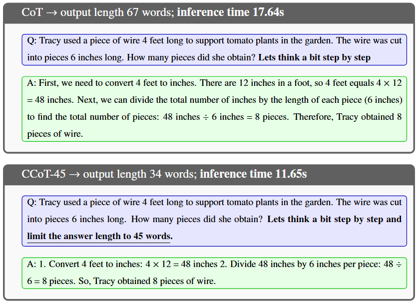
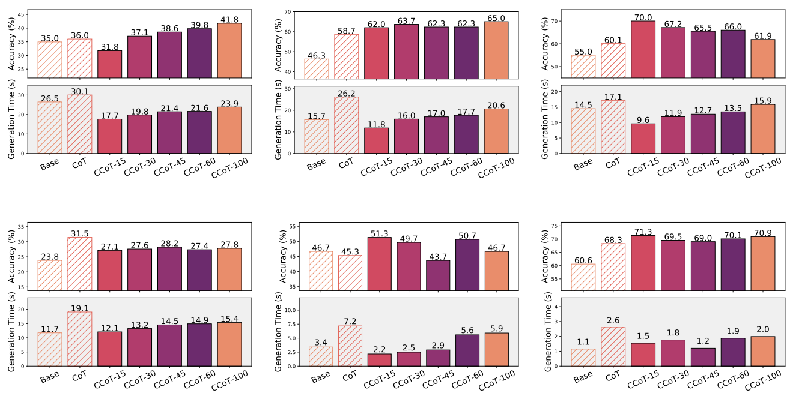
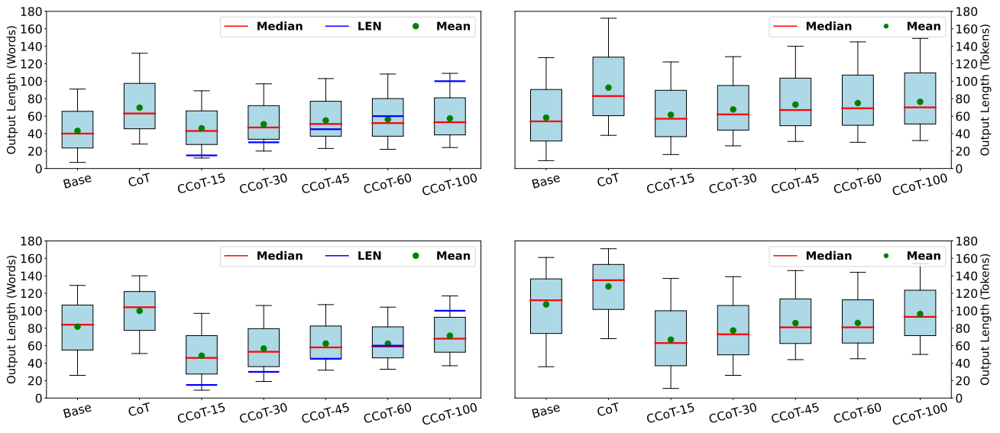

[](https://arxiv.org/abs/2407.19825)
[](https://arxiv.org/pdf/2407.19825)
[](https://opensource.org/licenses/MIT)
[](https://www.python.org/)

# Constrained Chain-of-Thought (CCoT)  
### Concise the Verbosity!

Chain-of-Thought (CoT) prompting has revolutionized large language model (LLM) reasoning by providing structured, step-by-step explanations that help achieve better results. However, this comes with a hidden cost: excessive verbosity, increased latency, and unpredictable generation times. **Constrained Chain-of-Thought (CCoT)** addresses these challenges with a refined prompt engineering strategy that empowers you to control the reasoning length of LLMs without sacrificing accuracy. By explicitly limiting output length, CCoT delivers concise, predictable, and cost-effective reasoning.

## CCoT Diagram
  
_Figure 1: CCoT Framework Overview_

---

## 🚀 Key Features
- 📏 **Length-Aware Reasoning**:  
   Control the output length (e.g., "limit to 30 words") to optimize for inference time, cost, and overall model efficiency.

- 📊 **Novel Metrics**:  
   Move beyond simple accuracy metrics. We introduce novel metrics such as **HCA (Human-Chain-of-Thought Accuracy)**, **SCA (Structured Chain-of-Thought Accuracy)**, and **CCA (Conciseness-to-Accuracy Ratio)**, which evaluate the trade-off between reasoning correctness and output conciseness.

- 🔍 **Deep Insights**:  
   Measure model behavior with new scores that help you understand how reasoning is structured:
   - **Redundancy Measure (RMS)**: Quantifies how much repetitive information the model introduces into its reasoning steps.
   - **Information Flow (I)**: Evaluates how efficiently the reasoning is compressed. The goal is to have fewer steps that contain all necessary logic for the task at hand.

---

## 🔑 Why Use CCoT?

### 🚀 **Efficiency**
Traditional Chain-of-Thought (CoT) often result in verbose and lengthy outputs, which increases latency and inference costs. CCoT introduces a controlled approach that ensures models generate concise reasoning, reducing unnecessary steps without sacrificing clarity or depth.

### 📉 **Cost Optimization**
By limiting output length, CCoT helps you save on computational resources and reduce the processing cost, making it more cost-effective for real-world applications.

### 🏆 **Higher Predictability**
CCoT allows you to set clear boundaries on the reasoning steps, making the model's behavior more predictable and reliable, especially in time-sensitive applications.

---

## 📊 Performance Metrics

### **Novel Metrics:**
1. **HCA**: This metric evaluates the accuracy of reasoning while ensuring that the output remains human-readable and logically sound.
2. **SCA**: Structured accuracy metric that considers the logical flow of reasoning while maintaining conciseness.
3. **CCA**: This is a ratio that compares the correctness of reasoning to the conciseness, giving a clear trade-off between these two aspects.

### **Additional Scores:**
- **RMS (Redundancy Measure)**: Measures the redundancy in reasoning steps. High redundancy indicates that the model repeats itself unnecessarily.
- **I (Information Flow)**: Evaluates how efficiently the reasoning is compressed. The goal is to have fewer steps that contain all necessary logic for the task at hand.

---

## 📊 Results

### **Accuracy vs. Conciseness**
CCoT delivers better **accuracy** with reduced reasoning steps. Below is the comparison:

  
_Figure 3: Accuracy comparison between traditional chain-of-thought and CCoT._

---

### **Length Comparison: With vs. Without CCoT**
CCoT significantly reduces the reasoning length without compromising accuracy. Below is the comparison of the output length for a reasoning task with and without applying the CCoT constraint.

  
_Figure 2: Length comparison between traditional chain-of-thought and CCoT._

---

## 🔧 Installation

1. Clone the repository:
    ```bash
    git clone https://github.com/sanianayab/Constrained-Chain-of-Thought-CCoT-.git
    ```

2. Install dependencies:
    ```bash
    pip install -r requirements.txt
    ```

---

## 🤝 Contribution

We welcome contributions from the research community! To contribute, please fork the repository and submit pull requests with your improvements. For detailed contributing guidelines, refer to [CONTRIBUTING.md](CONTRIBUTING.md).

---

## 🙏 Acknowledgments

This work was carried out at the **Department of Excellence in Robotics and AI, TeCIP**, **Scuola Superiore Sant'Anna**.

The motivation behind this work stems from its integration into a project with **Mediavoice s.r.l.**, Rome, Italy. Special thanks to Mediavoice for providing the collaboration that allowed this study to be conducted.

---

## 📚 Citation

If you use **CCoT** in your research, please cite the following paper 

```bibtex
@article{nayab2024concise,
  title={Concise thoughts: Impact of output length on LLM reasoning and cost},
  author={Nayab, Sania and Rossolini, Giulio and Simoni, Marco and Saracino, Andrea and Buttazzo, Giorgio and Manes, Nicolamaria and Giacomelli, Fabrizio},
  journal={arXiv preprint arXiv:2407.19825},
  year={2024}
}


